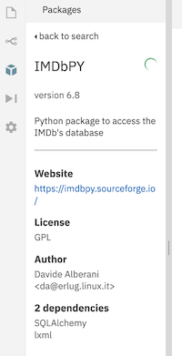

## Recommended Packages/Data Sources

### Tweepy

- [Documentation](http://docs.tweepy.org/en/latest/)

### PRAW: Python Reddit API Wrapper.

- [Documentation](https://praw.readthedocs.io/en/latest/)

### IMDB

- [Documentation](https://imdbpy.readthedocs.io/en/latest/)

Be careful which one you try to install! Here is the correct one:

### Open Corporates Data API

- [Documentation](https://api.opencorporates.com/documentation/API-Reference)
- [Usage limits](https://api.opencorporates.com/documentation/API-Reference#usage-limits)

## Other Ideas?

I don't want to scare you off of the idea of using data that interests you, but keep this in mind:

> _I can only provide _very limited help_ with data sources that I don't already know. This includes troubleshooting (does the NASA API work? I've never used it, so I don't know) and answering questions about how to get data or what the data means (what even is a Pokeman? I have no freaking clue.) There will be no extensions or exceptions given for this project, so as soon as possible make sure you know that a dataset works the way you think it works._

There are many, many data sources out there that you could use for this project. Here are just a few:

- [The Pokemon API](https://pokeapi.co/)
- [The last.fm music data API](https://www.last.fm/api)
- [The Spotify API](https://developer.spotify.com/documentation/web-api/)
- [MalShare: A free Malware repository providing researchers access to samples, malicious feeds, and Yara results.](https://www.malshare.com/index.php)
- [The GoodReads API](https://www.goodreads.com/api)
- [Data API from/about NPR](https://dev.npr.org/)
- A whole catalog of data from [The World Bank](https://datacatalog.worldbank.org/)
- [The Aztro horoscope API](https://aztro.readthedocs.io/en/latest/)
- [An API of Ice and Fire](https://anapioficeandfire.com/)
- [Clash of Clans Data API](https://developer.clashofclans.com)
